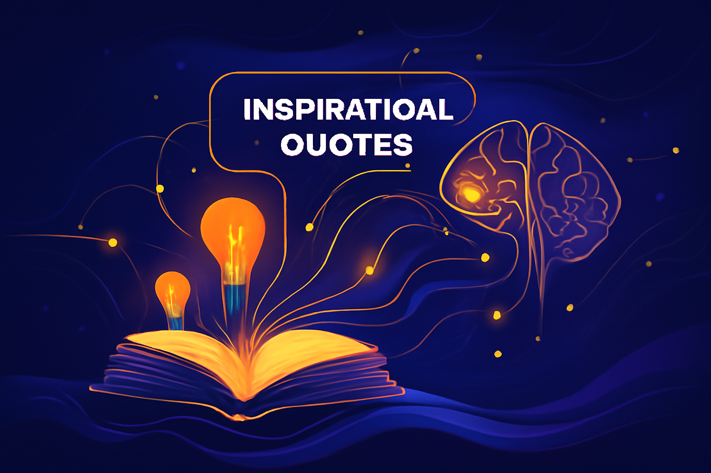

# AIQuotes — AI-powered Quote Gallery ✨

Live demo → [https://pooyanasiri.github.io/AIQuotes/](https://pooyanasiri.github.io/AIQuotes/)

AIQuotes is a minimal, elegant web app that generates motivational and inspirational quotes using AI. The app presents the quotes in a beautiful, responsive gallery that’s perfect for personal inspiration, sharing, or embedding on personal sites or demos.

## Features
- **AI-powered Quote Generation**: Get inspiring quotes generated through OpenAI's API.
- **Interactive UI**: Adjust the number of words and choose from a variety of quote styles (motivational, philosophical, etc.).
- **Beautiful and Responsive Design**: The gallery adapts seamlessly across devices, offering a smooth experience on both desktop and mobile.
- **Easy Integration**: Easily embed the quote generator into your site or demo.

## How It Works
The web app utilizes a backend Google Apps Script that interfaces with the OpenAI API to generate dynamic, inspirational quotes. The frontend leverages React to create a modern and interactive user interface, giving users control over the quote's word count and style.

## License & Contact
- See the repository for license details.
- Author: [Pooya Nasiri](https://github.com/PooyaNasiri) | [Portfolio](https://pooyanasiri.github.io)

## Acknowledgements
- Thanks to the contributors and to the open-source community for the libraries and inspiration.

Enjoy the demo: [https://pooyanasiri.github.io/AIQuotes/](https://pooyanasiri.github.io/AIQuotes/)
